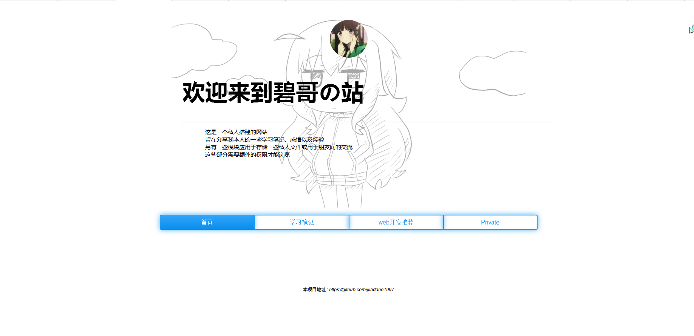

# Note 2:前端开发

## CSS-为我们的第一个网页增加CSS

通过我们第一章的学习，我们已经能够搭建一个“*网站*”了，虽然这个网站只有一页，哈哈。如果你已经迫不及待的想去和朋友炫耀一下的话，你还需要将你的服务端程序**部署**到一台有公网ip的服务器上。 具体的部署教程请看 [Note 3-4 部署服务器]()

好了，在我们开始前端开发之前，我们再重新理解一下什么是前端开发。引用百度百科的话：
>Web前端开发是从网页制作演变而来的 <br />

想必大家各自有了各自的理解，希望大家在开始学习前端开发之前，一定要有一个自己的整体理解。毕竟“知其然。知其所以然嘛”。

下面我将演示如何搭建我的网站的首页 网站地址：[网站地址]()，下面所用到的所有CSS都会在[Note 2-3]:CSS开发总结 中进行总结，因此暂时不理解也不要紧。

由于本篇教程比较长，我又觉得分篇来讲逻辑就不够清晰了，尽力而为尽力而为。、

<br/>
<br/>

### 第一步 ：设计网页

恕我这里吹嘘一波，我在学习web开发之前，自学了3个月的Photoshop，还帮别人设计过名片。这里我想吐槽的是，设计这种东西，各有所好，大家尽力就好，实在没有灵感了，就去“**借鉴**”别人的设计，哈哈。

废话少说，言归正传。在设计网页时，我个人推荐一个非常好的网站 http://zh.learnlayout.com/ 。<br/>
在很早以前，设计网页使用的是叫做 table 布局的方式，顾名思义，整篇网页全部用html的 table标签 ，这种布局方法有他的好处---简单。然而却有违背于html的table标签只是用来表达 “表格” 这个概念，再加上各种各样的其他原因，table布局被更新为了 "**div+css布局**"<br / >

div布局使用div标签（《div》《/div》） 来定义每一个逻辑上的“**块**”，比如在[我的网页]()中，最大的块有3个,分别是 *头像块 Avatar * , *简介块 Brief* ,*导航块 Nav* 。每一个块中又可以嵌套各种各样的“**小块**” 。<br />
由于我们的“块”可能非常的多，全部使用div标签会非常的杂乱，因此我在“小块”通常使用一些 p ul table 等标签，我也推荐大家这样做。

那么，在这里我大致将我的网页分为了以下几个“块”:<br/>
头像块 Avatar 包含一张图片，图片圆角居中显示 <br/>
简介块 Brief  包含两段话 , 第一段是标题，第二段是介绍，中间一条分割线 <br/>
导航块 Nav    包含四个按钮。 <br/>
最后再把所有块包含于一个app块，用于显示背景图像 <br/>


<br/>
<br/>

### 第二步 ：编写网页

废话少说，我们直接开始。

首先我们新建一个html文件，当然使用sublime或者其他的文本编辑器，配合emit插件，可以自动扩展html标签，使你事半功倍。

新建好的html文件应该像这样 [点我]()

<br/>

##### app块

然后我们先从背景图像开始：我们为app类添加css代码，每句CSS代码的目的已经写出来了。

```css
.app{
	background-image: url(avatarbackground.jpg); /*定义背景图像，url后为背景图像地址，地址为相对地址*/
	background-position: center;		     /*背景图像基于中心位置*/
	background-repeat: no-repeat;		     /*背景图像不重复显示*/
	height:500px;				     /*div块的高度，不定义的话默认为子元素高度和，可能显示不全图像*/
	width: 1080px;				     /*div块的宽度，不定义默认为父元素宽度，这里定义为1080PX，优化手机显示*/
	margin:10px auto;			     /*使当前div块居中显示*/
}
```

<br/>

##### avatar块

接着我们开始编写头像部分代码：首先我们需要一张图片作为我们的头像来源，我作为一个二次元肥宅，当然选择二次元头像啦。这里为了表现我的逼格，我采用的是从Gravtar一个全球头像库获取的，详情请大家百度Gravtar。我们需要做的很简单，就是在avatar块中添加代码如下：

```html
<div class="avatar">
	
```

然后图片就出现啦，下面再添加一点CSS使其圆角+居中：

```css
.avatar{
	text-align=center;                           /*这句话表示"行内元素"水平居中显示，需要配合内容为行内元素*/
}
.img{
	border-radius: 60px;			     /*圆角*/
        display: inline;			     /*使img表现为“行内元素”，配合text—align进行水平居中*/
}
```

<br/>

##### brief块
这一部分的html代码很简单：如下面

```html
<div class="brief">
	<h1>欢迎来到碧哥の站</h1>
	<hr/>
	<p className="breifPragraph">
		这是一个私人搭建的网站<br/>
		旨在分享我本人的一些学习笔记、感悟以及经验<br/>
		另有一些模块应用于存储一些私人文件或用于朋友间的交流<br/>
		这些部分需要额外的权限才能浏览
	</p>
</div>
```

然后再微调一下左右间距和字体大小：

``` css
.breif{
	margin-left: 100px;
	font-size: 30px;
}

.breifPragraph{
	margin-left: 60px;
	font-size: 15px;
}

```

<br/>

##### nav块
nav块是这篇页面中最难的部分，因为他涉及到了4个“小块”在一行内同时显示。大家可能都有各自不同的处理办法，下面我仅说出我的处理方法供参考。<br/>
首先最外层使用一个ul标签，然后内层使用4个相同的li标签，每个li标签再使用a标签。<br/>
这样做的好处是逻辑比较清晰，根据ul标签的语意来理解就是4个水平排列的列表，每个列表都是一个a标签。

``` html
<div class="nav">
<ul>
			<li>
				<a  href="" className="navButton-left button button-glow button-rounded button-raised button-primary">首页</a>
			</li>
			<li>
				<a  href="/note" className="navButton button button-glow button-border button-rounded button-primary">学习笔记</a>
			</li>
			<li>
				<a  href="" className="navButton button button-glow button-border button-rounded button-primary">web开发推荐</a>
			</li>
			<li>
				<a  href="" className="navButton-right button button-glow button-border button-rounded button-primary">Private</a>
			</li>
</ul>
</div>
```

为了使按钮好看，我使用了[button CSS样式库](http://www.bootcss.com/p/buttons/)。然后再使ul居中显示：

``` css
li{
	display: inline-block;               /*使列表水平显示*/
}
.navButton-left{
	width:250px;	                     /*每个导航按钮指定一个固定宽度。否则默认为子元素宽度之和，每个按钮的总宽度就会和字的多少正相关，					             而不是相等*/
	height: 40px;                        /*设定高度。否则默认为子元素高度和，太矮*/
	border-width: 1px 0px 1px 1px;       /*最左边的按钮没有右边框*/
	border-radius: 4px 0px 0px 4px;	     /*最左边的按钮没有右边框*/
}
.navButton-right{
	width:250px;			     /*同上*/
	height: 40px;	  	 	     /*同上*/
	border-width: 2px 2px 2px 2px;	     /*最右边的按钮没有左边框*/
	border-radius: 0px 4px 4px 0px;      /*最右边的按钮没有左边框*/
}
.navButton{
	width:250px;			     /*同上*/
	height: 40px;			     /*同上*/
	border-width: 2px 0px 2px 2px;       /*中间的按钮没有右边框*/
	border-radius: 0px;		     /*中间的按钮没有右边框*/
}
```

<br/>

##### 收尾

最后别忘了在html中引入我们的CSS文件和button库哦
``` html
	<link rel="stylesheet" href="buttons.css" >
	<link rel="stylesheet" href="custom.css" >
```
<br/>

最后的完成合影 耶！



