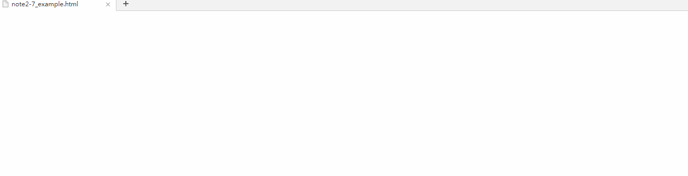

# 前端开发

## 动画

本篇中的动画并不是指html中嵌入的第三方动画，例如：FLASH、嵌入的视频等。

本篇中的动画指的是html中的某个元素的CSS值连续快速的变化，以产生类似于动画的效果。

例如：假设一架飞机从屏幕上飞过，实质上是一个img标签的left值不断的变化（前提是position值不是static）。由于html和css并不具备像C、C++编程语言的特性；而动画要求对一个值（比如之前提到的left值），在一段时间进行连续的变化，因此绝大多数动画都需要借助JavaScript来进行。

>在以前，实现一个动画需要借助JavaScript的 *setInterval(code,millisec)* 函数，这个函数的作用是：每经过 *millisec* 时间，就执行一次 *code* 里面的语句。 如果将一个img标签的left值每1/24s增加一定值，那么久由于人眼的暂留效应，就会形成帧数为1秒24帧的连贯的动画。

读到这里，你一定会想，我就是简单的想实现一个飞机从左到右的动画都需要写10多行，甚至更多行的代码，那简直太麻烦！ 很幸运的是，现在，通过 *trasition* 和 *animation* 这两个CSS属性，我们可以很简单的实现动画。下面是这两个属性的简单用法，具体用法还请大家百度：

>虽然说 *trasition* 和 *animation* 让动画变得非常简单，但是最原始的、最复杂，但也是最灵活的 JavaScript 动画在某些时候也可以展现他的风采。因此下面我分别将一个动画 使用JavaScript、CSS的 *trasition* 属性、 *animation* 属性三种方式分别实现，


### 最终完成成果如下



#### 三种类型分别实现

假设我们的HTML和CSS文件如下：

``` html
<!DOCTYPE html>
<html>
<head>
    <link rel="stylesheet" type="text/css" href="note2-7_example.css" />
    <script src="note2-7_example.js"></script>
</head>
<body>
    
</body>
</html>
```
``` CSS
.example {
    position:relative;
    top:0px;
    left:0px;
}
```

#### JavaScript原生实现
``` JavaScript
//note2-7_example.js
var img = document.getElementsByClassName("example")[0];

//动画持续总时间10s
var duration = 1000*10;     
//动画目前持续时间
var duration_now = null;       
//动画执行总过程,图片移动1920px;
var left = 1920;
//动画目前执行过程
var left_now =null;  

var img_timer = setInterval(img_animation,1000/24);

function img_animation(){
    duration_now += 1000/24;
    
    //判断当前时间是否超过了动画应该持续的总时间
    if(duration_now <= duration){
        //letf的值根据目前持续时间呈线性比例
        left_now = left*(duration_now/duration);
        img.style.left = left_now + "px";
    }
    else{
        clearInterval(img_timer);
    }
}
```


#### 使用trasition属性实现

首先修改css文件
``` CSS
.example {
    position:relative;
    top:0px;
    left:0px;
+   transition:left 10s;
}
```

然后修改JS文件
``` javascript
    //note2-7_example.js
    img = document.getElementsByClassName("example")[0];
    img.style.left = "1920px";
```


#### 使用animation实现

修改css文件
``` css
.example {
    position:relative;
    top:0px;
    left:0px;
+   animation:10s example_move;
}

@keyframes example_move{
+   0%{left:0px}
+   100%{left:1920px}
}
```


## 总结

JavaScript实现的动画主要原理是根据时间来快速的改变CSS值，因此可以灵活的设置改变比例，从而实现动画速度控制，也可以同时改变多个CSS值，总而言之，JavaScript动画的主要特点是灵活、可以实现各种复杂动画。

*trasition* 的实现和 *animation* 类似，同时animation比trasition更加灵活，因此大多数情况下，都可以使用animation代替trasition。

#### animation的使用

*animation* 几乎可以替代大部分的JS动画，特别是在一些一直循环的动画时，可以使用 *infinite* 值非常方便的替代JavaScript。

另外一种非常常见的情况：动画根据JavaScript的事件来触发。

>例如点击按钮弹出下拉框(list)，那么则需要在CSS中这样定义：

``` CSS
.list{
    position:relative;
    ...
    font:20px "Microsoft YaHei";
    opacity:0;
}
.list-show{
    animation:1s list_show forwards;
}
@keyframes list_show{
    0%{opacity:0}
    100%{opacity:1}
}
```

然后当点击按钮时，只需要将class="list" => class="list list-show"（可以使用DOM接口：*document.getElementsByClassName("list")[0].classList.toogle("list-show")* ），这样就可以播放一次动画，这是非常常用的操作。

## 其他

【CSS动画】CSS给一个元素添加多个动画，animation : 3s 动画1 forwards , 3s 动画2 forwards;
