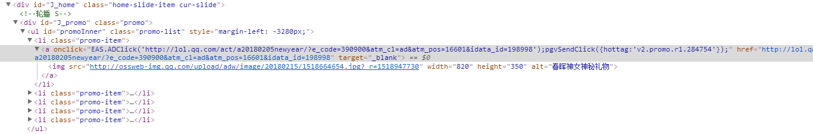

# 下拉菜单

 下拉菜单是很常见的前端组件。

 参考百度翻译的下拉菜单: [http://fanyi.baidu.com](http://fanyi.baidu.com/)

 

 下拉菜单分为两个部分：触发按钮 和 弹出菜单。

 *弹出菜单* 可以设置为position:absolute，以免弹出对整个文档流造成影响（重排），并且与 *触发按钮* 位于同一个父标签下，当不需要时设置为 display:none ，需要时设置为 block。 

 以下是我模仿 百度翻译 页面的一个下拉菜单，没有什么特别的，仅供个人复习用：

 **代码请见本页面最后附录部分**

<br>
<br>


# 轮播组件

轮播通常在网站的首页可以看到，例如京东首页：


例如 英雄联盟 首页：


通过上面两个例子，可以看到，轮播组件的主要作用是用于展示网站的活动、广告等。轮播组件大致可以分成两类，第一类是像英雄联盟首页一样，轮播的切换是“像左滑动”；第二类则是像京东首页一样，切换效果是“渐隐渐显”。

## 对英雄联盟轮播的代码分析：



通过开发者工具可以很方便的定位到这个轮播组件的源码。源码上还有很多注释，腾讯的工作态度很严谨。

这个轮播组件实现的原理是：

- 1.最外层使用div块作为框体，并设置overflow:hidden。
- 2.中间层使用一个ol，position设置为relative，作为控制。**注意这里需要手动设置ol宽度为图片宽度之和，并设置li.display:inline-block，这样图片才能水平**
- 3.内层多个li包含图片单行，从左到右排列，display:inline-block。
- 4.切换时，只需要控制ol的left值，即可实现切换（可以加上trasition实现慢速切换动画效果）
- *5.注意* 这种从左到右滑动的方法在 最后一张 和 第一张之间切换时无法产生动画，虽然可以采用一些hack办法进行弥补，例如：假设一共5张图片，设置为123451。但是 英雄联盟首页并没有专门进行优化。

## 对京东轮播的代码分析

- 1.最外层使用div块框体，overflow：hidden
- 2.内层使用多个li，通过position:relative，调整到同一个地方,z-index都为0。
- 3.切换时，改变每个li的opacity即可。


# 选项卡切换

待补充


# 附录：代码

## 1.下拉菜单

HTML
``` HTML
<!DOCTYPE html>
<html>
<head>
    <meta charset="utf-8" />
    <meta http-equiv="X-UA-Compatible" content="IE=edge">
    <title>Drop down menu</title>
    <meta name="viewport" content="width=device-width, initial-scale=1">
    <link rel="stylesheet" type="text/css" media="screen" href="note4-2_dropdown.css" />
    <script src="main.js"></script>
</head>
<body>
    <div class="main">
        <span class="triggerButton">触发按钮</span>
        <!--这里的i标签标准应该用来表示斜体，但是通常用来表示图标(icon)-->
        <i></i>
        <ol class="dropDownMenu">
            <!--设置一个空白的“遮挡”，使按钮和弹出菜单“无缝衔接”，融为一体-->
            <div class="dropDownMenu-headerBlank"></div>
            <span class="dropDownMenu-border">
                <span class="dropDownMenu-title">选项：</span>
                <li>选项1</li>
                <li>选项2</li>
            </span>
        </ol>
    </div>
</body>
</html>
```


CSS
``` CSS
.main{
    position: relative;                 /*为absolute定位提供基础元素*/
    text-align: center;
}


.main > i{      /*使用i标签表示图标，这里表示三角形图标*/
    position: relative;
    top: 10px;
    border-width: 6px;
    border-color: #777 transparent transparent;
    border-style: solid;
}


.main:hover > .dropDownMenu {
    display: block;
}
.main:hover > .triggerButton{
    padding: 10px;
    border-color: #dedede;
    border-width: 1px 1px 0 1px;
    border-style: solid;
}


/*下拉菜单部分CSS*/
.dropDownMenu {
    display: none;
    position: absolute;         /*下拉菜单为absolute定位，防止收起时对其他元素影响*/
    top: 10px;
    left: 559px;
    list-style: none;
}

.dropDownMenu > .dropDownMenu-headerBlank{  /*设置一个顶部空白遮挡，看起来更好看*/
    position: absolute;         /*这里需要注意，absolute元素也可以为子absolute元素提供定位*/
    left: 44px;
    top: -4px;
    background-color: white;
    width: 81px;
    height: 20px;
}
.dropDownMenu > .dropDownMenu-border{        /*下拉菜单的边框*/
    display: inline-block;
    padding: 20px;
    border: 1px solid #dedede;
    border-radius: 2px;
}

.dropDownMenu  .dropDownMenu-title{         /*菜单项间距*/
    display: inline-block;
    margin: 20px;
}

.dropDownMenu > .dropDownMenu-border > li{  /*菜单项间距*/
    margin: 10px;
}
```